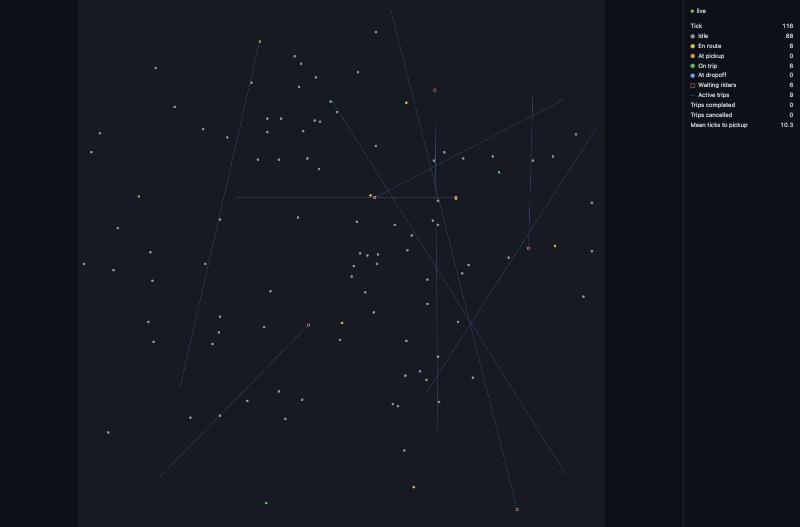

# uber-simulator

Ride-hailing simulator for learning and fun: drivers, riders, and dispatch run as independent services over NATS on a synthetic city grid, watched live in the browser. What it does: [docs/spec.md](docs/spec.md). Why: [docs/adr](docs/adr/README.md).

Status: milestone 8 done. Driver brain places drivers, wanders idle ones, and carries trips from offer to completion. Dispatch brain accepts trip requests, tracks driver positions, each tick offers queued trips to the nearest idle driver, and matches accepted offers or requeues declined and expired ones, confirms pickup and completion on driver arrivals, and cancels trips before pickup. Rider brain spawns riders (Poisson demand) that request trips, cancel when their patience runs out, and leave once their trip completes or is cancelled. An in-memory bus delivers messages deterministically (publish order), and a generic service shell runs any brain on it (publishes outputs, logs rejected inputs). A runner starts driver shards, dispatch, and riders on that bus and drives them for N ticks, showing each message as it is published and returning the event log only when asked; same seed and config give the same log. An invariant checker reports spec invariant violations (`docs/spec.md`) from the event log alone, message by message. `bun run sim` runs it all headless and prints a summary, checked and summarized as the run goes without keeping the log. A NATS bus adapter implements the same bus over a local NATS server (Docker Compose), and `bun run dev` runs clock, dispatch, riders, and each driver shard as its own process on it. `bun run sim -- --bus nats` runs the same simulation over NATS, each service on its own connection; integration tests check it breaks no invariant. `bun run ui` serves a browser page that subscribes to the events over NATS WebSocket and draws the live city on a canvas with a side panel of counters. A local ClickHouse (Docker Compose) has an `events` table (`bun run db:migrate`); a persister service (started by `bun run dev`) stores every event from a NATS JetStream stream in it, tagged with the run id, and `bun run report` answers "how did this run go?" from it. Dispatch matches greedily by default or in batches (`--matching batched`, `MATCHING=batched`), and `bun run sim -- --compare` runs both on one seed side by side. Riders spawn uniformly by default or around downtown and airport hotspots (`--demand city`, `DEMAND=city`), and the demand rate and fleet size are set per run. Drivers stay online by default or work shifts, alternating online and offline periods and finishing any trip first (`--shifts on`, `SHIFTS=on`). How it fits together: [docs/architecture.md](docs/architecture.md).

## Prerequisites

- [Bun](https://bun.com) 1.4.2
- [Docker](https://docs.docker.com) with Compose (for local NATS and ClickHouse)

## Setup

```bash
bun install
```

```bash
cp .env.example .env
```

## Local infra

NATS with JetStream and a websocket listener, and ClickHouse ([docs/architecture.md](docs/architecture.md#local-infra)). ClickHouse's user, password, and database come from `.env` (`CLICKHOUSE_USER`, `CLICKHOUSE_PASSWORD`, `CLICKHOUSE_DB`) and are created on its first start. Start and wait until healthy:

```bash
docker compose up -d --wait
```

Status and logs:

```bash
docker compose ps
```

```bash
docker compose logs -f nats
```

Create the ClickHouse `events` table (ADR 0029) from `infra/clickhouse/*.sql`; rerunning is a no-op. The persister also does this on every start, so `bun run dev` doesn't need it. Exit code 0 applied, 1 ClickHouse unreachable or a migration failed, 2 invalid config:

```bash
bun run db:migrate
```

Stop (keeps JetStream data in the `nats-data` volume, ClickHouse data in `clickhouse-data`):

```bash
docker compose down
```

## Run

Seeded headless run at spec scale (500 × 500 grid, 2 shards × 50 drivers, 10 trip requests/min). Defaults: `--seed 1 --ticks 3600` (1 simulated hour), `--matching greedy`. `--matching batched` makes dispatch match every `--batch-window` ticks (default `5`) instead ([ADR 0030](docs/adr/0030-batched-matching.md)). `--demand city` spawns riders around downtown and airport hotspots instead of uniformly (default `uniform`, [ADR 0031](docs/adr/0031-hotspot-demand.md)); `--requests-per-minute` (default `10`) and `--drivers-per-shard` (default `50`) set load and fleet size. `--shifts on` makes drivers work shifts: online 1200-2400 ticks, offline 300-900 ticks, 80% online at start (default `off`: all online the whole run, [ADR 0032](docs/adr/0032-driver-shifts.md)).

```bash
bun run sim -- --seed 42 --ticks 3600
```

Prints seed, ticks, matching strategy, demand model, requests per minute, driver shards (shards × drivers per shard), shifts, drivers, trips requested / completed / cancelled, mean ticks from request to pickup, rejected inputs, and invariant violations (one JSON line each). Exit code 0 ok, 1 invariant violated, 2 invalid args or `NATS_URL`, 3 NATS unreachable.

Same run over NATS, each service on its own connection, ticks as fast as the services settle (needs the local NATS server and `NATS_URL`, see Local infra; don't run `bun run dev` on the same server at the same time). Only each publisher's order is guaranteed, so the counts can differ from the in-process run and between runs. The summary starts with `run id: <id>`, a fresh UUID per run carried as the `Run-Id` header on every message ([ADR 0029](docs/adr/0029-event-persistence.md)):

```bash
bun run sim -- --seed 42 --ticks 600 --bus nats
```

### Compare matching strategies

Runs greedy and batched matching in process on the same seed (riders request the same trips in both) and prints seed, ticks, batch window, demand model, requests per minute, driver shards, and shifts, then their numbers side by side, then any invariant violations (one JSON line each, tagged with the strategy). Takes `--seed`, `--ticks`, `--batch-window`, `--demand`, `--requests-per-minute`, `--drivers-per-shard`, `--shifts`; in process only (`--bus nats` exits 2). Exit code 1 if either run violates an invariant, 2 invalid args.

```bash
bun run sim -- --compare --seed 42 --ticks 3600 --batch-window 5
```

Result (seed 42, 3600 ticks, window 5):

| | greedy | batched |
| --- | ---: | ---: |
| trips requested | 566 | 566 |
| trips completed | 477 | 474 |
| trips cancelled | 19 | 21 |
| mean ticks from request to pickup | 61.1 | 62.0 |
| invariant violations | 0 | 0 |

Heavy load: city demand, 3× the requests, half the fleet (50 drivers for about 1,800 requests an hour, far more than they can serve):

```bash
bun run sim -- --compare --seed 42 --ticks 3600 --demand city --requests-per-minute 30 --drivers-per-shard 25 --batch-window 5
```

| | greedy | batched |
| --- | ---: | ---: |
| trips requested | 1717 | 1717 |
| trips completed | 235 | 421 |
| trips cancelled | 1358 | 1160 |
| mean ticks from request to pickup | 186.8 | 124.2 |
| invariant violations | 0 | 0 |

At spec load the strategies are within noise, but under overload batched matching completes about 1.8× the trips with a third less waiting, likely because greedy serves the oldest queued trips first from whatever idle driver is nearest to them, however far, while batched minimizes total pickup distance.

Same two runs with shifts on (about a quarter of the fleet offline at any time):

```bash
bun run sim -- --compare --seed 42 --ticks 3600 --batch-window 5 --shifts on
bun run sim -- --compare --seed 42 --ticks 3600 --demand city --requests-per-minute 30 --drivers-per-shard 25 --batch-window 5 --shifts on
```

| | spec load, greedy | spec load, batched | heavy load, greedy | heavy load, batched |
| --- | ---: | ---: | ---: | ---: |
| trips requested | 566 | 566 | 1717 | 1717 |
| trips completed | 426 | 433 | 180 | 352 |
| trips cancelled | 71 | 63 | 1413 | 1227 |
| mean ticks from request to pickup | 79.9 | 79.2 | 190.4 | 126.2 |
| invariant violations | 0 | 0 | 0 | 0 |

Shifts cost about 10% of completed trips at spec load (cancellations at least triple as waits grow by 17-19 ticks) and 16-23% under heavy load, where batched still completes about 2× greedy's trips.

### As separate processes over NATS

Needs the local NATS server and ClickHouse (`docker compose up -d --wait`); the persister creates the `events` table itself on start. Starts the persister, then (once its stream exists, so no event is missed) dispatch, riders, one process per driver shard, and the clock; if the persister isn't ready within 30 s, everything stops (exit code 1). Their output is prefixed by service, one JSON log line per entry (started with run id and seed, NATS disconnect/reconnect/close, rejected inputs, dropped messages, stopped). Ctrl+C stops them all; so does any one of them exiting (exit code 1).

Each start gets a new run id (a UUID), printed first as `[dev] run id: <id>` and in every `service_started` line. Every message the services publish carries it as a `Run-Id` NATS header ([ADR 0029](docs/adr/0029-event-persistence.md)); it is how persisted events are told apart by run.

```bash
bun run dev
```

Config from env (Bun loads `.env`; defaults are spec scale, real time):

| Variable | Default | Meaning |
| --- | --- | --- |
| `NATS_URL` | (required) | NATS server |
| `RUN_ID` | (set by `bun run dev`) | run id stamped on every publish; letters, digits, `-`, `_`. Required when starting a service entrypoint directly |
| `SEED` | `1` | seed for every service's random stream |
| `SPEED` | `1` | sim seconds per wall second: one tick every 1 s / `SPEED` |
| `CLOCK_START_DELAY_MS` | `2000` | wall time the clock waits before tick 1, so the other services are subscribed |
| `DRIVER_SHARDS` | `2` | driver shard processes |
| `DRIVERS_PER_SHARD` | `50` | drivers in each shard |
| `REQUESTS_PER_MINUTE` | `10` | rider demand |
| `DEMAND` | `uniform` | rider demand model: `uniform` or `city` (downtown + airport hotspots, [ADR 0031](docs/adr/0031-hotspot-demand.md)) |
| `SHIFTS` | `off` | driver shifts: `off` (all online) or `on` (the `--shifts on` preset, [ADR 0032](docs/adr/0032-driver-shifts.md)) |
| `MATCHING` | `greedy` | dispatch strategy: `greedy` or `batched` ([ADR 0030](docs/adr/0030-batched-matching.md)) |
| `BATCH_WINDOW_TICKS` | `5` | batched only: dispatch matches on ticks that are multiples of it |
| `CLICKHOUSE_URL`, `CLICKHOUSE_USER`, `CLICKHOUSE_PASSWORD`, `CLICKHOUSE_DB` | (required) | ClickHouse the persister writes to |

E.g. 100× real time, so trips complete within seconds:

```bash
SPEED=100 bun run dev
```

### See the stored events

The persister ([ADR 0029](docs/adr/0029-event-persistence.md)) reads every `sim.events.>` message from the JetStream stream `SIM_EVENTS` (kept 24 h, so events published while it is down are stored once it is back) and inserts them into the `events` table within about a second, at least once: a redelivered event is stored again with the same `stream_seq` and collapses on merge, so exact queries use `FINAL`. Events without a `Run-Id` header get `run_id = 'unknown'`. Events published by the NATS integration tests (`bun run test`) also land in the stream once it exists, and the next persister run stores them under the tests' run ids. Its log lines: `service_started`, `message_dropped` (payload not an event), `insert_failed` (retried after 1, 2, 4, 8 s), `batch_not_persisted` (redelivered after 60 s), `service_stopped`. Run alone: `bun src/persister/main.ts` (migrates the `events` table first; exit codes 0 stopped by SIGINT/SIGTERM, 1 NATS / ClickHouse unreachable, migration or JetStream failed, 2 invalid config).

With `bun run dev` running (or after it), event counts per run and type, using the image's `clickhouse-client` and the `.env` defaults (user, password, database `sim`):

```bash
docker compose exec clickhouse clickhouse-client --user sim --password sim -d sim -q "SELECT run_id, type, count() FROM events FINAL GROUP BY run_id, type ORDER BY run_id, type"
```

One run's trips, by the run id `bun run dev` printed:

```bash
docker compose exec clickhouse clickhouse-client --user sim --password sim -d sim --param_run=<run id> -q "SELECT tick, type, trip_id, driver_id, rider_id FROM events FINAL WHERE run_id = {run:String} AND type LIKE 'trip.%' ORDER BY tick, stream_seq LIMIT 20"
```

### Report a run

`bun run report` queries the stored events per run ([ADR 0029](docs/adr/0029-event-persistence.md)), counting redelivered events once. End to end, from a stopped stack:

```bash
docker compose up -d --wait
```

```bash
bun run db:migrate
```

Run the simulation at 100 ticks per second for a few seconds, then stop it with Ctrl+C. It prints its run id first (`[dev] run id: <id>`):

```bash
SPEED=100 bun run dev
```

Stored runs, oldest first: run id, first-last tick, event count. Runs from the NATS integration tests show up too (see above).

```bash
bun run report -- --list
```

```
0743136a-b1f0-4c9b-8303-b5d3d22b286b  ticks 0-1404  143100 events
```

One run, by its id:

```bash
bun run report -- --run <run id>
```

```
run id: 0743136a-b1f0-4c9b-8303-b5d3d22b286b
trips requested: 210
trips completed: 148
trips cancelled: 2
mean ticks from request to pickup: 53.4
mean ticks from pickup to completion: 304.6
completed trips per simulated minute: 6.3
```

Events still in the JetStream stream when `bun run dev` stops are stored on the persister's next start, so a report right after Ctrl+C can be slightly short. Means count trips with both ends stored (`n/a` when none); trips per simulated minute is over the run's first-to-last tick span (1 tick = 1 simulated second). Trip counts and mean ticks to pickup are the same numbers `bun run sim` prints for an in-process run of the same events. Exit codes: 0 ok, 1 unknown run id (`unknown run id: <id>`), ClickHouse unreachable, or a query failed (e.g. the `events` table doesn't exist yet: run `bun run db:migrate`), 2 invalid args (neither or both of `--list` / `--run`, or a malformed run id) or invalid `CLICKHOUSE_*` config.

### Replay a run

`bun run replay` republishes a stored run's events on NATS under `replay.<run id>.<live subject>` (e.g. `replay.<run id>.sim.events.driver.moved`), in `tick, stream_seq` order, paced by tick: a tick's events go out `(tick - start tick) / speed` seconds after the first replayed tick ([ADR 0034](docs/adr/0034-replay.md)). It never publishes on `sim.*`, so replays aren't stored again, and it exits once the run's events are exhausted. Needs the local infra and a run stored by `bun run dev` (see [Report a run](#report-a-run): `bun run report -- --list` shows stored runs).

```bash
bun run replay -- --run <run id> --speed 20
```

```
{"service":"replay","type":"replay_started","runId":"d1381885-6d24-4935-8d3b-6dad1056bab3","startTick":0,"speed":20}
{"service":"replay","type":"replay_finished","runId":"d1381885-6d24-4935-8d3b-6dad1056bab3","events":76249}
```

`--speed N` (default `1`, any positive number): sim seconds per wall second, like `SPEED`. `--from-tick T` starts at the first stored tick >= `T` (trips already in flight then). Watch it with any NATS subscriber on `replay.<run id>.>`. Log lines: `replay_started`, `stored_event_skipped` (a stored payload that doesn't parse as an event), `replay_finished` (events published). Exit codes: 0 replayed, 1 no stored events for the run id (from `--from-tick`), 2 invalid args (missing `--run`, a malformed run id, a non-positive speed, a negative or fractional start tick) or invalid `NATS_URL` / `CLICKHOUSE_*` config, 3 NATS or ClickHouse unreachable or a query failed (e.g. the `events` table doesn't exist yet: run `bun run db:migrate`).

### Benchmark

One in-process run at a given fleet size, demand scaled with it at the spec ratio (10 requests/min per 100 drivers), uniform demand, shifts off. Defaults: `--drivers 1000 --ticks 600 --matching greedy --batch-window 5 --shards 2 --seed 1`; `--drivers` must split evenly over `--shards`. `--max-minutes` (positive, fractions ok; default no limit) stops the run once a tick ends past that much wall time.

```bash
bun run bench -- --drivers 1000 --ticks 600 --matching greedy
```

Prints the run settings, wall ms per tick (mean, p95; tick 1 includes starting the services), total messages, peak RSS, and JS heap size and object count at the end (no event log is kept), and `status: finished`. Stopped at `--max-minutes`, it prints the same for the ticks done (`ticks: 4050 of 100000`) with `status: did not finish in N min`; CPU profiles are still written. Exit code 0 ok, 2 invalid args, 3 stopped at `--max-minutes`. CPU and heap profiles come from Bun's own flags ([bun.com/docs/project/benchmarking](https://bun.com/docs/project/benchmarking)), e.g. `bun --cpu-prof-md --cpu-prof-dir profiles src/bench/main.ts --drivers 1000`.

Wall timings on a busy dev machine mean little: measure in CI with the `bench` workflow (`.github/workflows/bench.yaml`, manual). `gh workflow run bench.yaml --ref master` runs 1k, 5k, 10k drivers × greedy, batched for 600 ticks, each stopped at 30 min (`-f timeout_minutes=N`; recorded as `did not finish`, or `out of memory` when killed; a `timeout` 5 min later is the backstop for a tick that never ends), with a CPU profile; narrow it with `-f drivers=10000 -f matching=greedy`, add `-f heap_profile=true` for a heap profile, `-f cpu_profile=false` to skip the CPU profile (it inflates peak RSS; use for memory measurements). Each run's report, profiles, and runner note (CPUs, memory, load average) are uploaded as an artifact (`gh run download <run id>`). Baseline and after-fix results, hot spots, and targets: [docs/performance.md](docs/performance.md).

### Watch it in the browser

With the local NATS server and `bun run dev` running (separate terminals), serve the UI:

```bash
bun run ui
```

Open http://localhost:3000. The canvas shows the city: drivers as dots colored by state, waiting riders as hollow squares, active trips as pickup -> dropoff lines. The side panel shows the tick, counters, the legend, and the connection status (connecting / live / disconnected). The page joins mid-run and reconnects on its own if NATS restarts.



| Variable | Default | Meaning |
| --- | --- | --- |
| `NATS_WS_URL` | (required) | NATS websocket the browser connects to |
| `UI_PORT` | `3000` | port the page is served on |

Exit code 2: invalid config.

A single service: `bun src/clock/main.ts`, `bun src/dispatch/main.ts`, `bun src/rider/main.ts`, `SHARD_INDEX=0 bun src/driver/main.ts`. Exit codes: 0 stopped by SIGINT/SIGTERM, 1 NATS connection failed or lost, 2 invalid config.

## Commands

Integration tests need the local infra (`docker compose up -d --wait`) and its URLs (Bun loads `.env`): NATS tests (bus, distributed runs) need `NATS_URL`, ClickHouse adapter, run report, and stored run reader tests need `CLICKHOUSE_URL` and the other `CLICKHOUSE_*` variables (they work in a throwaway database), persister and replay tests need both (their own streams or run ids and a throwaway database). Without the URL, each group is skipped with a warning.

```bash
bun run test
```

```bash
bun run lint
```

```bash
bun run check
```

```bash
bun run typecheck
```

## Workflow

Tickets, PRs, review, CI: [ADR 0021](docs/adr/0021-development-workflow.md).
