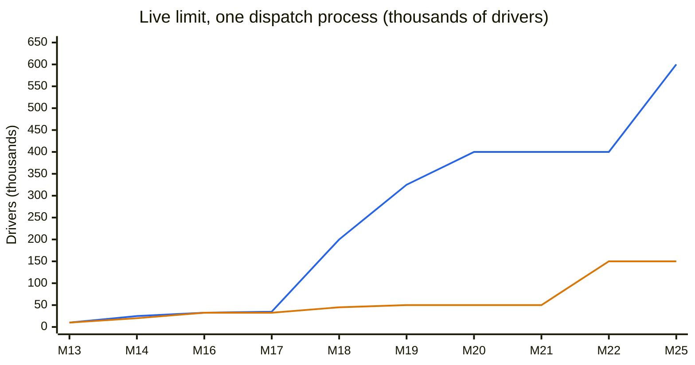

# Scaling case study

How the simulator went from 100 drivers in one process to 600,000 drivers live over NATS: what was measured at each step, what limited it, what was tried, and what went wrong along the way. [Section 11](#11-surge-pricing-and-drivers-chasing-it) covers surge pricing, the first feature past the original scope, measured the same way. Every number here comes from [performance-history.md](performance-history.md), [performance.md](performance.md), [ui.md](ui.md), an ADR, the README or a PR review, linked where it is used; those pages hold the full tables, CI run IDs and caveats.

## What "keeps up" means

v1 was specified for 100 drivers and about 10 trip requests per minute ([spec](spec.md)). Every service (clock, dispatch, riders, driver shards, persister) runs as its own process and talks only over NATS ([ADR 0017](adr/0017-independent-actor-services-with-pure-brains.md), [ADR 0028](adr/0028-nats-bus-subjects-and-delivery.md)); the persister stores every event in ClickHouse ([ADR 0029](adr/0029-event-persistence.md)).

Two measurements recur below:

- **In process** (`bun run bench`): all brains in one Bun process on an in-memory bus. It measures the brains' work per tick, with no NATS or ClickHouse.
- **Live** (`bun run loadtest`, [ADR 0037](adr/0037-end-to-end-load-test.md)): the whole distributed stack at real time (one tick per second) for 600 ticks, demand at the spec ratio (10 requests/min per 100 drivers). A run passes when settle p95 (last event of a tick minus that tick's `clock.ticked`) is at most 610 ms, at most 1% of ticks overrun (an event of a tick arriving after the next tick's `clock.ticked`), the persister's backlog stays bounded, it drains, and NATS reports no slow consumers. A size counts as the limit only when every run of it passes, at least two runs on two runners ([How to measure](performance.md#how-to-measure)).

All runs are on GitHub's `ubuntu-latest` runner. That detail turned out to matter more than expected (section 7).

## The live limit per milestone

Blue (upper line): greedy matching. Orange (lower line): batched matching. Both with one dispatch process (`1x1`). Data, one row per milestone that re-measured live limits:

| Milestone | Greedy | Batched | What changed before it | Source |
| --- | ---: | ---: | --- | --- |
| 13 | 10k | at least 10k | first live measurement | [Live limits](performance-history.md#live-limits) |
| 14 | 25k | 20k | persister batch size ([0039](adr/0039-persister-batch-size.md)) | [After milestone 14](performance-history.md#after-milestone-14) |
| 16 | 32.5k | 32.5k | per-service subscriptions ([0042](adr/0042-subscribe-to-taken-types.md)) | [After milestone 16](performance-history.md#after-milestone-16) |
| 17 | 35k | 32.5k | persister pipelining ([0044](adr/0044-persister-pipelining.md)) | [After milestone 17](performance-history.md#after-milestone-17) |
| 18 | 200k | 45k | moves in batches ([0045](adr/0045-publish-driver-moves-in-batches.md)) | [After milestone 18](performance-history.md#after-milestone-18) |
| 19 | 325k | 50k | compact moves, idle drivers kept ([0047](adr/0047-driver-moves-as-parallel-arrays.md), [0048](adr/0048-keep-idle-drivers-across-ticks.md)) | [After milestone 19](performance-history.md#after-milestone-19) |
| 20 | 400k | 50k | cheaper move handling ([#244](https://github.com/kludw/uber-simulator/pull/244)) | [After milestone 20](performance-history.md#after-milestone-20) |
| 21 | 400k | 50k | dispatch split by region ([0050](adr/0050-split-dispatch-by-region.md)); helped only split layouts | [After milestone 21](performance-history.md#after-milestone-21) |
| 22 | 400k (spot-check) | 150k | exact batched matching, cheaper ([0051](adr/0051-search-untouched-drivers-in-batched-matching.md)) | [After milestone 22](performance-history.md#after-milestone-22) |
| 25 | 600k | 150k | driver indexes in moves ([0052](adr/0052-driver-indexes-in-moves.md)) | [After milestone 25](performance-history.md#after-milestone-25) |

## 1. One process, 100 to 50k drivers

The first profile at 1k-10k drivers ([Results](performance-history.md#results), [Top hot spots](performance-history.md#top-hot-spots-cpu-profiles-self-time)) found two single causes. Greedy at 10k had a p95 of 1,047.6 ms per tick, 96.0% of CPU in one `Map` constructor: dispatch copied its whole driver-position map on every driver report, O(drivers²) per tick. Batched matching padded its cost matrix to a square and ran the O(n³) Hungarian loop over the padding: one batch tick at 5k took 1,695 s, 28 minutes.

[ADR 0033](adr/0033-scale-fixes.md) let a brain update the state it owns in place where a profile shows the cost, and made the matrix rectangular. 10k greedy p95 fell to 32.76 ms (32×), and batched at 5k and 10k went from not finishing to under 70 ms p95 ([After milestone 9 fixes](performance-history.md#after-milestone-9-fixes)). [ADR 0036](adr/0036-scale-to-50k.md) did the same for the driver and rider brains and added a grid index for the nearest idle driver: at 50k greedy p95 fell from 267.24 ms to 30.75-42.41 ms, batched from 972.13 to 566.24-599.53 ms ([After milestone 12](performance-history.md#after-milestone-12)).

Single runs then reached 500k greedy in process at p95 612.35 ms; batched gave out between 50k and 76k ([Ceiling](performance-history.md#ceiling)). The 500k number later turned out to be measured with too little demand (see [Mistakes and surprises](#mistakes-and-surprises)).

## 2. Going live: the persister was the first wall

The first live measurement (milestone 13) gave greedy 10k, batched at least 10k, five times below the in-process 50k ([Live limits](performance-history.md#live-limits)). Settle stayed at or under 415 ms up to 20k; what failed was the persister falling behind. Its rounds of 1,000 events spent 62.6-75.8% of their time in the ClickHouse insert, 62-67 ms per round ([Persister timing](performance-history.md#persister-timing)). Raising the batch to 10,000 events ([ADR 0039](adr/0039-persister-batch-size.md)) made inserts 8-12× cheaper per event ([After raising the batch size](performance-history.md#after-raising-the-batch-size)), and milestone 14 reached greedy 25k, batched 20k, with settle now failing first ([After milestone 14](performance-history.md#after-milestone-14)).

The same milestone found the load test's own criterion was wrong. ADR 0037 judged the persister by whether its pending count rose between the halves of the run; that read "rising" in 15 of 16 runs, including 9 of the 10 that kept up, so strictly no size passed, not even 1k ([The pending-trend rule](performance-history.md#the-pending-trend-rule-at-t--600)). [ADR 0038](adr/0038-persister-backlog-criterion.md) replaced it with a bound of 3 ticks of events.

## 3. Every service decoded everything

Recording CPU per service showed the clock, which publishes one message per tick, using 81-100 CPU seconds per run: every service subscribed to `sim.>` and decoded all traffic, and that alone was 76-81% of dispatch's and each shard's CPU ([CPU time per service](performance-history.md#cpu-time-per-service)). Dispatch used 98.9% of what it received, the shards 0.3%, the riders 0.2% ([Service timing](performance-history.md#service-timing)).

[ADR 0042](adr/0042-subscribe-to-taken-types.md) subscribes each service only to the types its brain takes. The clock's CPU fell from 76-114 s to 1.1-1.3 s per run, and settle p95 at 27.5k from 595.0-645.3 ms (two EPYC 7763 runs) to 313.1-321.8 ms (an EPYC 9V74 and a 7763 run) ([Subscriptions per service](performance-history.md#subscriptions-per-service)). Milestone 16: greedy and batched 32.5k, with the persister failing first again ([After milestone 16](performance-history.md#after-milestone-16)).

## 4. A ClickHouse merge, and a smaller gain than projected

At 35k the persister kept up for most of the run, then fell behind in the last 25 seconds, at the same samples in four runs. Adding the NATS server's and ClickHouse's CPU to the report showed why: the spike coincided with one ClickHouse merge of about 20.7M rows at 1.09-1.22 cores ([Infra CPU](performance-history.md#infra-cpu)). Whether 35k passed depended on whether that merge landed before tick 600.

[ADR 0044](adr/0044-persister-pipelining.md) overlapped the persister's next fetch with the current insert. It projected 170-200 ms rounds while behind; measured rounds during the merge were 266-294 ms, because decode and insert each grew by about 20 ms ([Persister pipelining](performance-history.md#persister-pipelining)). Still enough for 35k on the EPYC 7763. Milestone 17: greedy 35k, batched 32.5k; the 40k target was not met ([After milestone 17](performance-history.md#after-milestone-17)).

## 5. One message per driver was the real cost

Measuring by message type answered why everything scaled with the fleet: `driver.moved` was 99.0% of events, 98.9% of payload bytes and 98.9% of persister rows, and 84% of dispatch's decode and handle time at 35k ([Cost of driver moves](performance-history.md#cost-of-driver-moves)). [ADR 0045](adr/0045-publish-driver-moves-in-batches.md) publishes each shard's moves of a tick as `drivers.moved` messages of up to 5,000 moves.

This was the largest single step. Milestone 18 reached greedy 200k (4 of 4 runs), up from 35k; events per tick at 200k were 1,988, against 35,336 at 35k, and the NATS server dropped from 0.55-0.57 cores to 0.07-0.11 ([After milestone 18](performance-history.md#after-milestone-18)). Batched reached 45k. Two side effects needed follow-ups:

- **The backlog unit changed.** A 5,000-move message counted as one event, so the 3-tick bound shrank to about 3% of the fleet in messages, while the persister holds 1-2.5 ticks in flight by design. Batched 40k failed the bound while keeping up ([What one unit of backlog now is](performance-history.md#what-one-unit-of-backlog-now-is)). [ADR 0046](adr/0046-persister-pending-criterion.md) counts only messages not yet delivered.
- **Batched dispatch reached 13 GiB.** At 100k-150k its peak RSS was 12,997-13,302 MiB: every batch tick built the whole queued × idle cost matrix, and at 200k the stack failed when ClickHouse rejected the persister's inserts for exceeding its memory limit; that limit was presumably what dispatch had left of the runner's memory (inferred, not verified). Filling one row at a time kept outcomes identical and cut dispatch's peak RSS about 60×, to 201.9-218.5 MiB ([Batched dispatch memory](performance-history.md#batched-dispatch-memory)).

## 6. Profiling dispatch, three cuts

From 200k, settle failed first, set by dispatch's one thread. A CPU profile at 200k split its tick into decoding `drivers.moved` (50.5-52.6%, Zod slightly more than JSON.parse) and the `clock.ticked` step (35.2-36.4%), which was mostly rebuilding the idle-driver snapshot from scratch every tick; matching itself was 4.1-4.2% ([Dispatch profile](performance-history.md#dispatch-profile)).

```mermaid
---
config:
  xyChart:
    width: 800
    height: 420
  themeVariables:
    xyChart:
      plotColorPalette: "#2563eb, #d97706, #6b7280"
---
xychart-beta
  title "Dispatch ms per tick before / after each cut (EPYC 7763)"
  x-axis ["200k before", "200k 0047", "300k before", "300k 0048", "400k before", "400k #244", "450k before", "450k 0052"]
  y-axis "ms per tick (wall time)" 0 --> 500
  bar [400.3, 239.6, 472.4, 357.5, 468.3, 353.2, 368.2, 175.6]
  bar [205.2, 152.4, 328.4, 200.4, 270.7, 207.5, 213.1, 111.8]
  bar [164.7, 117.4, 248.4, 70.7, 116.6, 73.8, 73.2, 71.3]
```

Stacked bars, bottom to top: grey `clock.ticked` step, orange `drivers.moved` handle, blue `drivers.moved` decode (bar height = their sum). Other message types are left out: 14.4-40.9 ms per tick, up to 19% of dispatch's total (450k after ADR 0052); the table gives the totals. Each pair is the same fleet size on the same CPU model, one run each, dispatch's `messages_timed` over 600 ticks (wall time, so it includes waiting for a CPU):

| Pair | Before run | After run | Decode / handle / step, before → after (ms) | All types, before → after (ms) | Source |
| --- | --- | --- | --- | --- | --- |
| 200k, [ADR 0047](adr/0047-driver-moves-as-parallel-arrays.md) | [37496763902](https://github.com/kludw/uber-simulator/actions/runs/37496763902) | [37536239553](https://github.com/kludw/uber-simulator/actions/runs/37536239553) | 195.1 / 40.5 / 164.7 → 87.2 / 35.0 / 117.4 | 416.1 → 254.0 | [Compact driver moves](performance-history.md#compact-driver-moves) |
| 300k, [ADR 0048](adr/0048-keep-idle-drivers-across-ticks.md) | [37539921316](https://github.com/kludw/uber-simulator/actions/runs/37539921316) | [37541548096](https://github.com/kludw/uber-simulator/actions/runs/37541548096) | 144.0 / 80.0 / 248.4 → 157.1 / 129.7 / 70.7 | 497.1 → 382.9 | [Idle drivers across ticks](performance-history.md#idle-drivers-across-ticks) |
| 400k, [#244](https://github.com/kludw/uber-simulator/pull/244) | [37545410989](https://github.com/kludw/uber-simulator/actions/runs/37545410989) | [37584363114](https://github.com/kludw/uber-simulator/actions/runs/37584363114) | 197.6 / 154.1 / 116.6 → 145.7 / 133.7 / 73.8 | 504.6 → 386.6 | [Move handling cut](performance-history.md#move-handling-cut) |
| 450k, [ADR 0052](adr/0052-driver-indexes-in-moves.md) | [37596576870](https://github.com/kludw/uber-simulator/actions/runs/37596576870) | [37691796420](https://github.com/kludw/uber-simulator/actions/runs/37691796420) | 155.1 / 139.9 / 73.2 → 63.8 / 40.5 / 71.3 | 403.9 → 216.5 | [After milestone 20](performance-history.md#after-milestone-20), [Dispatch drivers by index](performance-history.md#dispatch-drivers-by-index) |

The 450k "before" run had demand 0.8% below the spec ratio ([Request draw cap](performance-history.md#request-draw-cap)).

- **Compact moves** ([ADR 0047](adr/0047-driver-moves-as-parallel-arrays.md)): parallel arrays of IDs and coordinates instead of an object per move. Decode 54-55% cheaper on the EPYC 7763, payload 61% smaller.
- **Idle drivers kept across ticks** ([ADR 0048](adr/0048-keep-idle-drivers-across-ticks.md)): the step 70-75% cheaper; each move now costs more to apply, so the net was 23-29% at 300k, where greedy 300k started passing. Milestone 19: greedy 325k, batched 50k ([After milestone 19](performance-history.md#after-milestone-19)).
- From 375k, dispatch became a NATS slow consumer at startup, when every driver published its own `driver.went_online` at once; batching those too ([ADR 0049](adr/0049-publish-drivers-going-online-in-batches.md)) removed it ([Drivers online in batches](performance-history.md#drivers-online-in-batches)).
- **A second profile, three local cuts** ([Dispatch moves profile](performance-history.md#dispatch-moves-profile), [#244](https://github.com/kludw/uber-simulator/pull/244)): check each array in one Zod pass, keep x and y as numbers on dispatch's driver record, smaller grid buckets. Dispatch 19-30% cheaper per tick on the EPYC 7763. Milestone 20: greedy 400k ([After milestone 20](performance-history.md#after-milestone-20)).

## 7. Regions lost: the runner is two cores

With dispatch's one thread the limit, milestone 21 split dispatch into one process per region ([ADR 0050](adr/0050-split-dispatch-by-region.md)). Its context said the runner had 4 CPUs and the stack used 1.4-1.9 cores, so a second dispatch process would have cores to spare.

Splitting lowered the greedy limit: `1x1` 400k, `2x1` 375k, `2x2` 350k ([After milestone 21](performance-history.md#after-milestone-21)). The PR review ([#257](https://github.com/kludw/uber-simulator/pull/257)) noted that each `2x1` instance received about half the moves yet cost 1.5-1.7× more per move, and re-checked the routing from the run artifacts: not a routing bug. Instrumented runs found the cause. `lscpu` on every runner checked: 4 CPUs are 2 physical cores with 2 SMT threads each. Two copies of the same decode on SMT siblings took 1.64-1.76× the time of one alone. Every CPU was 49-50% busy on average, but each tick's moves arrive in one burst that every service handles at once, so an extra process adds a thread to an already full burst ([Why splitting dispatch doesn't help greedy here](performance-history.md#why-splitting-dispatch-doesnt-help-greedy-here), [Runner topology](performance-history.md#runner-topology)).

Batched did gain, because its matching cost falls faster than linearly with region size: `2x1` 75k, `2x2` 100k, against 50k at `1x1`. Milestone 24 tried to measure regions on a larger runner; the repo belongs to a personal account, the jobs asking for larger runners got none, and nothing was measured ([Larger runner](performance-history.md#larger-runner)).

## 8. Exact batched matching, 25-41× faster

Batched matching is exact: as many pairs as possible at the least total pickup distance ([ADR 0030](adr/0030-batched-matching.md)). At 50k a batch had 412 queued trips against 32k idle drivers on average, and 64-74% of dispatch's time live went to the solver scanning every idle driver on every augmenting-path step ([Cheaper batched matching](performance-history.md#cheaper-batched-matching)).

The solver adds one trip at a time along an augmenting path: the cheapest chain of reassignments that frees a driver for it, priced with a per-driver adjustment (its dual potential) that starts at 0 and changes only once a path reaches that driver. The paths are short (2-4 steps per trip), and a driver no path has reached still has dual potential 0, so the cheapest such driver from a trip is simply its nearest untouched allowed idle driver: one query to the existing grid index instead of a scan ([ADR 0051](adr/0051-search-untouched-drivers-in-batched-matching.md)). It stays exact: the same pair count and total distance as the dense solver on 3,000 random instances and on every batch of the in-process comparison runs. On the same CPU model a batch got 41× faster at 50k and 25× at 100k. The PR review ([#260](https://github.com/kludw/uber-simulator/pull/260)) ran mutation checks and its own comparison against the dense solver, and flagged that the new solver assumes every cell is on the grid, now documented.

Milestone 22: batched `1x1` 150k, `2x1` 225k, `2x2` 250k, two and a half to three times the previous limits ([After milestone 22](performance-history.md#after-milestone-22)).

## 9. Indexes instead of IDs

Moves still carried a string ID per driver, parsed and looked up in a `Map` by every consumer. [ADR 0052](adr/0052-driver-indexes-in-moves.md) sends driver indexes instead, and dispatch keeps its drivers in an array by index. In a single-process benchmark this cut dispatch's decode and apply by 74-80% at 400k-500k ([Driver indexes in moves](performance-history.md#driver-indexes-in-moves)).

Milestone 25: greedy `1x1` 600k, 4 of 4 runs; spot-checks `2x1` 600k and `2x2` 500k; batched `1x1` unchanged at 150k, since its limit is the batch step ([After milestone 25](performance-history.md#after-milestone-25)).

## 10. The UI at scale

The browser UI was measured with the same honesty test: does it apply everything that arrives? Before milestone 26, at 100k it drew 5.0 frames per second and applied 19% of the feed's bytes; at 400k 1.7 frames per second and about 2%, and NATS cut the page off as a slow consumer. The view copied its maps on every event, and the canvas drew one arc per driver per frame, 354 ms per frame at 400k ([Today's UI](ui.md#todays-ui-master-1ab377c)).

[ADR 0053](adr/0053-scale-the-ui-in-the-browser.md) keeps drivers in typed arrays by index, updated in place, and above 10,000 drivers draws a heatmap of 5 × 5-cell tiles recomputed once per tick. The page now applies all of the feed at 60 frames per second at 10k, 100k and 400k, spending 32.3-32.9 ms per second on decode and apply at 400k ([Heatmap](ui.md#heatmap-285)). `bun run demo` runs it at 100k.

## 11. Surge pricing, and drivers chasing it

Surge was the first feature past the original scope. The goal was a model each part of which fits in a sentence, not realistic economics ([ADR 0054](adr/0054-price-trips-with-zone-surge.md)).

**The model.** The grid is cut into 50 × 50-cell zones (500 m). Every 30 ticks dispatch sets each zone's surge to its unmatched trips (requested, no driver yet) over its idle drivers, rounded to 0.1 and clamped to 1.0-2.0×. A new rider draws a max surge, uniform in 1.0-3.0: if its zone's price is higher, it declines and leaves; otherwise it pays ($2.50 + $2 per km) × surge, fixed at request. Dispatch already held both counts, exact and per region, so pricing needed no new view and no extra decoding of moves. In the spike, a plain ratio capped at 3.0 jumped 1 → 2 → 3 in sparse zones, so most riders who saw a surge declined: 638 declines on heavy batched load against 440 at cap 2.0. A softer formula did about as well as the plain ratio at cap 2.0, with more words to explain ([ADR 0054](adr/0054-price-trips-with-zone-surge.md#context)).

**What it does.** At spec load almost nothing surged in the spike (one surged request in 2,264), and completed, cancelled and pickup times were identical. Under heavy load, surge trades patience cancellations for up-front declines. These heavy-load figures are from ADR 0054's spike, surge without chasing: cancellations fell 25-36%, 23-26% of spawned riders declined, completed trips stayed supply-bound (−8% to +3%) and revenue rose 13-33%. Heavy greedy, for example: cancellations 1,358 → 1,016, declines 0 → 392, revenue $1,818 → $2,414. The README's [`--compare-surge` table](../README.md#compare-surge-off-and-on) shows today's numbers, with chasing: heavy greedy 991 cancelled, 400 declined, $2,479.92. Surge adds no drivers; it turns away up front riders who would have waited and given up. In the busy city, batched matching lost 20 completions (−3%); the ADR says this is "likely" because declines cluster at the downtown hotspot, and does not claim more ([ADR 0054 rationale](adr/0054-price-trips-with-zone-surge.md#rationale)).

**Drivers chase surge.** Milestone 30 closed the loop: an idle driver picking a target heads for a random cell of the nearest surging zone within 4 zones (2 km), and on each new price every idle driver not already heading into a surging zone looks again ([ADR 0055](adr/0055-idle-drivers-chase-surge.md)). Both rules came from the spike. A reach of 3-5 zones scored close together; 1-2 zones were too short to find surge, and 6 or more pulled drivers past nearer demand. Re-picking on new prices doubled the effect, cutting declines by 65% instead of 30%, because a random wander target is about 333 cells away and a driver otherwise ignores surge for minutes.

At the README's 100 drivers chasing changes nothing beyond seed noise: an idle driver is offered a trip within a tick or two wherever it is. At 10k drivers with city demand (greedy, seed 42, 1,800 ticks), idle drivers sit in quiet zones while downtown surges ([ADR 0055](adr/0055-idle-drivers-chase-surge.md#context), [README](../README.md#compare-surge-off-and-on)):

| | Completed | Cancelled | Declined | Mean ticks to pickup | Revenue |
| --- | ---: | ---: | ---: | ---: | ---: |
| surge off | 32,764 | 2,931 | 0 | 68.2 | $272,062 |
| surge on, no chasing | 30,489 | 868 | 5,803 | 48.0 | $289,878 |
| surge on, chasing | 34,343 | 505 | 2,003 | 32.3 | $297,288 |

Surge alone completed 7% fewer trips than no surge; with chasing it completed 5% more, at half the ticks to pickup. Live, greedy `1x1` 600k with surge on and chasing passed both runs at settle p95 522.9 and 525.1 ms, against 552.8 and 567.3 ms for milestone 28 without chasing. The runs landed on different CPU models and the load test's uniform demand rarely surges, so this shows no regression, not a speed-up ([After milestone 30](performance-history.md#after-milestone-30)).

**Surge off stays byte-identical.** Each surge PR had to keep surge-off outputs and event logs byte-identical, checked on the README seeds ([ADR 0054](adr/0054-price-trips-with-zone-surge.md#consequences)). Willingness to pay and chase targets come from their own seeded child streams (`willingness:<tick>`, `chase:<tick>`), so a decline or a chase shifts no other draw. The cost of keeping it simple: chasing has no off switch, so surge on without chasing can now only be compared on paper, against ADR 0054's table ([ADR 0055 decision 6](adr/0055-idle-drivers-chase-surge.md#decision)).

**What review caught.** Three findings from the reviews of the two ADRs:

- **Prices that never arrived.** The draft gave `zones.priced` a `region` field and called its subject unregioned. The publisher added `.region-<k>` to any message with a `region` field, but subscribers did so only for a fixed set of ten types. Over NATS, riders would never have seen a price; the spike ran in process, where the bus routes by type, so it never showed. The fix was to key subjects on the type set ([#302 review](https://github.com/kludw/uber-simulator/pull/302#discussion_r4222147017)).
- **"Waiting" meant two things.** The draft priced zones by "waiting trips", but `waiting` was already a rider state and the UI's waiting riders, which include matched trips. The term became **unmatched trips** ([#302 review](https://github.com/kludw/uber-simulator/pull/302#discussion_r4222147021)).
- **Heap growth that was garbage.** The chasing ADR's draft read a +43% "heap at end" from `bun run bench` at 600k as growth to explain ([ADR 0055](adr/0055-idle-drivers-chase-surge.md#context)). The bench reads the heap without collecting first, and chasing allocates a record per re-pick. With a forced collection first, the review found no retained growth. The ADR now states the metric, and the live check reported peak RSS instead ([#320 review](https://github.com/kludw/uber-simulator/pull/320#discussion_r4224504548)).

## Mistakes and surprises

- **Demand stopped growing at about 447k drivers.** The riders' Poisson draw used Knuth's method, whose `Math.exp(-mean)` underflows to 0 above a mean of about 745 per tick, so requests stayed near 745 per tick whatever the fleet. The in-process 500k result and one live 500k pass ran about 11% light. Found in milestone 20's re-measure; fixed by drawing large means in chunks of at most 700 ([Request draw cap](performance-history.md#request-draw-cap), [#247](https://github.com/kludw/uber-simulator/pull/247)).
- **"4 CPUs" meant 2 cores.** Several sections of performance history, the spec and ADR 0050's context read run-average CPU as spare cores. [Runner topology](performance-history.md#runner-topology) lists each reading it supersedes; the numbers stand, the conclusions drawn from them about spare cores don't.
- **Projections ran optimistic.** Pipelining the persister was projected at 170-200 ms rounds and measured 266-294 ms. ADR 0047 described its check as four refines per message; the next profile found the merged schema still checked element by element, 86 ms per tick at 400k, fixed in #244 ([Dispatch moves profile](performance-history.md#dispatch-moves-profile)).
- **Dispatch missed drivers at startup.** Dispatch could subscribe after a shard had already published its drivers, and core NATS doesn't replay ([Start-up race](performance-history.md#start-up-race)). [ADR 0043](adr/0043-learn-drivers-from-moves.md) lets dispatch learn a driver from its next move instead of fixing the start order.
- **The CPU model decides near the limit.** Runners vary between EPYC 7763, 9V45, 9V74 and several Xeons. Greedy `1x1` 700k passes on the 9V45, 9V74 and Xeon 8573C runs and fails on all three EPYC 7763 runs ([After milestone 25](performance-history.md#after-milestone-25)).

## Where it stands

From [performance.md](performance.md#current-live-limits):

| Matching | `1x1` | `2x1` | `2x2` |
| --- | ---: | ---: | ---: |
| greedy | 600k | 600k (spot-check) | 500k (spot-check) |
| batched | 150k | 250k | 300k |

What fails first ([What fails first](performance.md#what-fails-first)):

- **Greedy**: settle, in every layout, from CPU contention on the runner's 2 cores. Failing `1x1` runs count 2.10-2.82 runner cores against 1.31-1.96 for passing 600k runs; the driver shards are now the largest CPU user, and dispatch's tick is split about evenly between moves and matching.
- **Batched**: dispatch's batch step on the slowest CPU model, in every layout.
- **Not limiting**: the persister and NATS slow consumers.

What's next ([Next steps](performance.md#next-steps)): more physical cores (a larger or self-hosted runner) or less CPU per tick in every service, starting with a profile of the driver shards at 600k-700k; a profile of batched `1x1` at 175k and `2x1` at 275k; and bracketing greedy `2x1` / `2x2` between their spot-checks. In process (`bun run bench`), greedy keeps up at 800k and batched at 200k ([In-process ceiling](performance.md#in-process-ceiling)).
