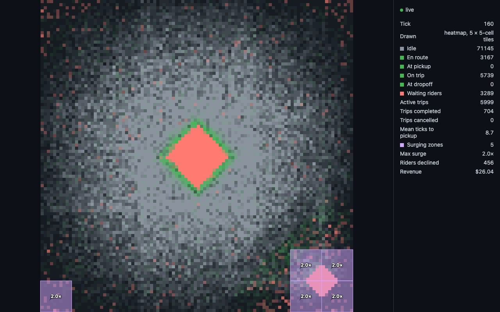
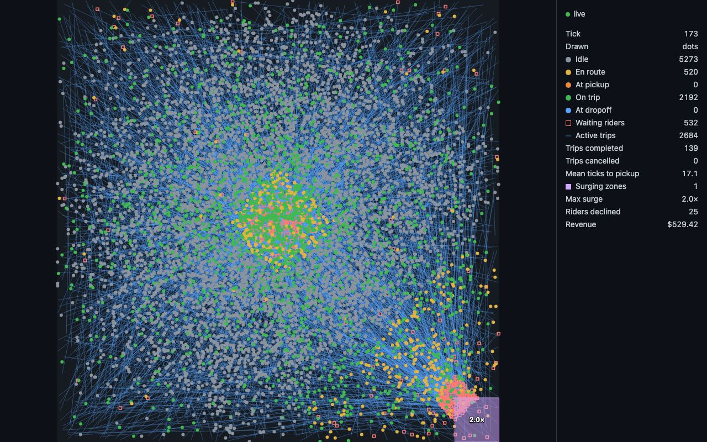

# UI at scale

How the browser UI ([ADR 0020](adr/0020-browser-ui-canvas-nats-websocket.md)) and its feed behave at 10k, 100k and 400k drivers, how that was measured, and what the UI does about it ([ADR 0053](adr/0053-scale-the-ui-in-the-browser.md)). Last measured 2026-10-08 on master `1ab377c`, the unmerged experiment branch `272-exp-ui-scale`, the view by index (#273), and the heatmap (#285).

## Method

- **Stack**: `bun run dev` (persister, clock, one dispatch, riders, 2 driver shards) against the local Docker Compose NATS and ClickHouse, `SPEED=1`, greedy, `1x1`, demand at the spec ratio (10 requests/min per 100 drivers). Uniform demand and shifts off unless the row says `city, shifts`. Sizes: 2 × 5,000, 2 × 50,000, 2 × 200,000 drivers per shard. All three sizes ran locally (400k is measured, not extrapolated); the stack kept one tick per wall second at each (80 `drivers.moved` messages per second at 400k = 400k / 5,000 per tick).
- **Feed** (`experiments/ui-feed.ts`): a Bun subscriber on the NATS websocket (`ws://localhost:9222`), subject `sim.events.>` like the page, counts messages and payload bytes per second by event type over 20-25 s (`count-only`: no parsing, so it never falls behind).
- **Browser** (`experiments/ui-browser.ts`): headless Chromium (Playwright `chromium-headless-shell` 1187), 1280 × 800 viewport, device pixel ratio 1. The page is the experiment branch's copy of `src/ui/`, instrumented to record draw time per animation frame and decode + `applyEvent` time per message. After 10-40 s of warm-up, one 20 s window: animation frames per second and frame interval (p50, p95, max), draw time per frame, decode + apply ms per wall second, messages and bytes the page applied per second, JS heap, and the main thread's busy share (Chrome DevTools Protocol `Performance.getMetrics` `TaskDuration` per wall second; an empty page reads 0.09). CPU profiles from the protocol's `Profiler`.
- **Server cost**: the NATS container's CPU (`docker stats`) during each browser window, against the same stack without a page open. The UI server (`bun run ui`) only serves the bundle and `/config.json`; it does no work per event.
- **Host**: the dev machine (10 CPUs, 32 GiB, macOS), load average 2-11 during the runs. One run per row: compare rows with each other, not with other machines. Headless Chromium rasterizes in software, so canvas cost is likely higher than in a desktop browser with GPU raster.

## Feed

What the page receives over the websocket, by fleet size. `drivers.moved` is 94-95% of the bytes; trip events add about 8 small messages per second per 1,000 drivers.

| Fleet | Messages / s | KB / s | `drivers.moved` messages / s | `drivers.moved` KB / s |
| --- | ---: | ---: | ---: | ---: |
| 10k | 87.5 | 129.9 | 2 | 122.4 |
| 100k | 838-858 | 1,398-1,414 | 20 | 1,338.5 |
| 400k | 3,419-3,943 | 5,858-6,062 | 79-80 | about 5,600 |

## Today's UI (master `1ab377c`)

| Fleet | Frames / s | Frame p50 / p95 (ms) | Draw p50 (ms) | Decode + apply (ms / s) | Applied of the feed | JS heap | Main thread busy |
| --- | ---: | ---: | ---: | ---: | --- | --- | ---: |
| 10k | 59.3 | 16.7 / 16.8 | 1.3 | 26.6 | all (93 msg/s, 133 KB/s) | 22.5-25.1 MB | 0.66 |
| 100k | 5.0 | 233 / 300 | 75.4 | 502.9 | 19% of bytes (265 of 1,398 KB/s) | 36-38 MB, growing | 1.2 |
| 400k | 1.7 | 533 / 1,183 | 354.0 | 456.8 | about 2% of bytes (102 of 5,858 KB/s) | 167-169 MB after 35 s, growing | 1.12 |

- **10k is fine; 100k and 400k fall behind for good.** At 100k the page applies a fifth of what arrives, so it shows a city that lags further every second; the unread messages pile up in the page (heap growing). At 400k NATS counted 2 slow consumers after the page ran: the server cut the page's connection (it reconnects and resubscribes, losing what was in between).
- **Two costs, both O(fleet) per unit of work instead of per message:**
  - **The view copies its maps on every event** (`applyEvent` is copy-on-write): `drivers.moved` copies the drivers map once per message (O(fleet) × 20-80 messages per tick), and every driver state event (`trip.matched`, arrivals, `trip.picked_up`, ...) copies it again through `withDriver`; every trip event copies `waitingRiders` or `activeTrips`. At 400k that is about 3,800 trip and driver events per second, each copying a map of 400k drivers or of about 20k trips.
  - **The canvas draws one arc per driver per frame**: 75 ms per frame at 100k, 354 ms at 400k, before rasterizing. At 400k about 18k active-trip lines add a native rasterizing cost of about 0.5 s per second (profile: `(program)` 620 ms/s with lines, 94 ms/s without).
- **Server cost is not the problem.** NATS CPU with the page open: 1.0-2.6% at 10k, 2.9-4.9% at 100k, 10.5-11.6% at 400k; without the page at 400k: 10.5-13.5%. One page is one more copy of the feed: 0.13, 1.4 and 6 MB/s.

## Spikes (experiment branch)

Each row adds to the one before, measured at 400k uniform unless noted.

| Change | Frames / s | Frame p95 (ms) | Draw p50 (ms) | Decode + apply (ms / s) | Applied of the feed | JS heap | Busy |
| --- | ---: | ---: | ---: | ---: | --- | --- | ---: |
| A1: moves update the drivers map in place | 2.5 | 833 | 351.7 | 214.8 | 268 KB/s | 70-72 MB | 1.9 |
| A2: + one pixel per cell above 20k drivers (grid-sized image, scaled up) | 1.9 | 950 | 10.9 | 1,057.7 | 30 KB/s | 87-91 MB | 1.25 |
| A3: + state events update the drivers map in place too | 23.6 | 133 | 9.7 | 298.3 | 2,615 of 6,062 KB/s | 50-63 MB | 1.0 |
| B: drivers in typed arrays by driver index, image redrawn once per tick | 27.2 | 133 | 1.1 | 352.9 | 3,200 KB/s | 34-60 MB | 0.99 |
| C: + rider and trip maps updated in place; above the threshold no trip lines, riders as pixels | **60** | **16.7** | 0 | **34.2** | **all** (4,613 msg/s, 6,111 KB/s) | 11-16 MB | **0.18** |
| C at 100k | 60 | 16.7 | 0 | 8.6 | all (859 msg/s, 1,399 KB/s) | 7-14 MB | 0.13 |
| D: 5 × 5-cell tile heatmap, 100k `city, shifts` | 60 | 16.7 | 0.1 | 7.7 | all (818 msg/s, 1,193 KB/s) | 7-19 MB | 0.15 |
| D at 400k `city, shifts` | 60 | 16.8 | 0 | 25.5 | all (3,028 msg/s, 4,776 KB/s) | 15-25 MB | 0.19 |

- A2 got slower than A1 at applying: the image removed the draw cost and exposed the state events' map copies (profile: `applyEvent` 234 ms/s self). B removed the per-move string IDs and objects; its profile still showed `applyEvent` at 253 ms/s from the rider and trip map copies, and `(program)` at 620 ms/s from 18k trip lines. C removed both.
- One pixel per cell (A2-C) is legible as a texture, not as information: at 100k uniform it is grey noise with a few coloured specks. The tile heatmap (D) shows where the work is: with `city` demand, downtown and the airport stand out as tiles full of busy drivers and waiting riders.

## View by index ([#273](https://github.com/kludw/uber-simulator/issues/273))

ADR 0053 slice 1: the view keeps drivers in typed arrays by driver index and updates in place; dots at every size. Measured 2026-10-08 on branch `273-ui-view-by-index` with the method above (uniform, shifts off), the page instrumented locally as on the experiment branch (decode + apply time per message, draw time per frame; at 400k the canvas skips drawing, since dots at 400k still fall behind and grow the heap by construction). Host load average 2.2-3.3. Feed at 400k: 3,389 messages/s, 5,934 KB/s.

| Fleet | Canvas | Frames / s | Frame p95 (ms) | Draw p50 (ms) | Decode + apply (ms / s) | Applied of the feed | JS heap |
| --- | --- | ---: | ---: | ---: | ---: | --- | --- |
| 10k | dots | 60 | 16.7 | 1.3-1.4 | 0.9 | all (78-85 msg/s, 129-132 KB/s) | 5.0-9.9 MB at 35 s, 6.4-8.4 MB at 80 s: flat |
| 400k | idle | 60 | 16.8 | 0 | 31.6-31.8 | all (3,480 msg/s, 5,976-6,005 KB/s) | 8.4-19.6 MB at 35 s, 10.6-20.8 MB at 60 s (not the flat-heap target: that is slice 2's, [Heatmap](#heatmap-285)) |

- **Target met**: decode + apply at 400k is 31.6-31.8 ms per wall second (target about 35, spike C 34.2); at 10k it fell from 26.6 to 0.9 ms/s, since a `drivers.moved` message no longer copies the drivers map.
- Two runs per row (warm-up 15 s and 40-60 s, 20 s windows); the heap ranges are `performance.memory` and the protocol's `JSHeapUsedSize`, read at the end of each window.

## Heatmap ([#285](https://github.com/kludw/uber-simulator/issues/285))

ADR 0053 slice 2: above 10,000 drivers the canvas draws the 5 × 5-cell tile heatmap, recomputed once per tick, instead of dots, trip lines and motion; the side panel says which is drawn. Measured 2026-10-08 on branch `285-ui-heatmap` with the method above, the page instrumented locally as for #273 (decode + apply time per message, draw time per frame, bytes applied); one run per row, 20 s window after 15 s of warm-up. Host load average 2.6-11 (other work on the machine).

| Fleet | Demand | Canvas | Frames / s | Frame p95 / max (ms) | Draw p50 / p95 (ms) | Decode + apply (ms / s) | Applied of the feed (page / feed KB/s) | Main thread busy |
| --- | --- | --- | ---: | ---: | ---: | ---: | --- | ---: |
| 10k | uniform | dots | 60 | 16.7 / 16.8 | 1.3 / 1.4 | 1.0 | all (85.5 msg/s, 130.8 KB/s) | 0.65 |
| 100k | uniform | heatmap | 60 | 16.7 / 16.8 | 0.1 / 0.2 | 9.2 | all (1,408 / 1,399) | 0.14 |
| 100k | `city, shifts` | heatmap | 60 | 16.7 / 16.8 | 0 / 0.2 | 7.8 | all (1,135 / 1,127) | 0.14 |
| 400k | uniform | heatmap | 60 | 16.7 / 16.8 | 0 / 0.2 | 32.3-32.9 | all (5,960-6,008 / 5,925) | 0.18-0.19 |
| 400k | uniform, page joined at tick 614 | heatmap | 60 | 16.7 / 16.8 | 0 / 0.2 | 35.7 | all (6,111 / 6,114) | 0.19 |
| 400k | `city, shifts` | heatmap | 60 | 16.7 / 16.8 | 0 / 0.2 | 27.2-27.3 | all (4,795 / 4,761) | 0.16-0.18 |

- **Target met** (ADR 0053 Decision 4): every message applied, 60 frames per second, frame p95 16.7 ms (target at most 33), at 10k, 100k and 400k. The page's bytes per second match the feed's within measuring noise (they are counted over different 20 s windows). The frame that recomputes the heatmap (once per tick) never exceeded 16.8 ms.
- **Heap flat**: JS heap after a forced GC (`HeapProfiler.collectGarbage`, then `performance.memory` / the protocol's `JSHeapUsedSize`), one page open 16 minutes at 400k uniform, joined at tick 54: it grows with the view's active trips while the run fills up, then stays flat once they do.

  | Page open | Tick | Active trips in the view | Heap after GC (MB) |
  | ---: | ---: | ---: | ---: |
  | 60 s | 114 | 39,140 | 15.4 / 8.2 |
  | 300 s | 354 | 166,648 | 33.3 / 26.2 |
  | 540 s | 595 | 219,233 | 43.6 / 35.4 |
  | 720 s | 775 | 227,089 | 44.0 / 36.3 |
  | 960 s | 1,015 | 226,563 | 43.6 / 36.4 |

  The growth is the active-trip map, about 140 bytes per trip, not a leak: a 400k uniform run holds about 227k active trips from tick 700 on (trips average about 350 ticks across the grid), far more than the about 18k seen in the first 80 ticks (Today's UI). Dots would draw a line per active trip; the heatmap draws none.
- **Which tick it shows**: the image is remade on the first frame after a new `clock.ticked`, before most of that tick's `drivers.moved` arrive, so it is mostly tick t-1's end state, with some of tick t's moves; a driver is at most one cell off, invisible at tile size.
- **What it shows**: with `city` demand at 100k, downtown and the airport stand out as red tiles of waiting riders; idle drivers gather toward the grid's middle (likely because wander targets are uniform, so paths cross the center more often; not measured), so the edges are darker.

## Surge ([#297](https://github.com/kludw/uber-simulator/issues/297))

[ADR 0054](adr/0054-price-trips-with-zone-surge.md)'s UI: with surge on, over dots or heatmap, each surging zone's part in the region that priced it (`zonePartBounds`, the layout from the UI server's `REGIONS`) is tinted purple, more the higher its surge, outlined and labeled (`1.4×`); drawn every frame from the view's latest `zones.priced` per region (at most 100 zones per region, so no per-tick caching). Once any `zones.priced` arrives, the panel adds surging zones (parts), max surge, riders declined and revenue: the fares of the trips the page saw from request to completion (`fareOf` at 1.0 for a trip without one, as the summary counts it), so a page joining mid-run shows less than `bun run sim` or `bun run report`. All of it resets with the view on a new run. Surge off: no `zones.priced`, no tint, no surge rows.

Checked 2026-10-08 on branch `297-surge-ui`, `bun run dev` with the demo's settings (`city` demand, shifts on, greedy, `1x1`, seed 1) and `SURGE=on`, page in headless Chromium at 1280 × 800 after 2-3 min:

- 100k (heatmap, page joined at tick 120): at tick 160, five zones at 2.0× (the four around the airport, one at the bottom-left corner), 456 riders declined; downtown, red with waiting riders, does not surge, since its many idle drivers outnumber its unmatched trips.

  

- 10k (dots): at tick 173, the airport zone at 2.0×, 25 riders declined.

  

## Decision

[ADR 0053](adr/0053-scale-the-ui-in-the-browser.md): keep the direct NATS subscription; the view keeps drivers by driver index in typed arrays and updates in place, so applying a message costs its own size; above 10,000 drivers (chosen: dots measured at 10k and 100k only) the canvas draws a tile heatmap once per tick instead of a dot per driver.

A new run on an open page resets the view, so nothing of the old one lingers: a `drivers.*` message of another fleet size (ADR 0053); a tick 0 message after the view has a tick, which is a new run's start-up (shards announce their fleet at tick 0, before the clock's first tick, 1), so the view takes tick 0 and its tick 1 doesn't start over again; or a `clock.ticked` before the view's tick, a run not starting at 0 (a replay `--from-tick`); or a `clock.ticked` more than one tick after the view's: the clock publishes every tick, so the view missed events, e.g. a replay `--from-tick` later than where the page's previous replay of the same run ended ([#299](https://github.com/kludw/uber-simulator/issues/299); a run id can't tell those apart, both replays carry one). The last three also catch a same-size new run and a replay watched twice ([#289](https://github.com/kludw/uber-simulator/issues/289)). A first tick never resets (a mid-run join, or `--from-tick` into a fresh page); the same tick again or the next keeps the view. Trade-off: a live page that loses a `clock.ticked` (core NATS drops messages to a slow consumer) starts over too, at that tick; its view had already missed events, and it refills like a mid-run join. These refine 0053's reset trigger, not the decision.

## Reproduce

On `272-exp-ui-scale`, with the local infra up and `bun run dev` running at a fleet size:

```bash
bun experiments/ui-feed.ts 20 ws://localhost:9222 count-only
NATS_WS_URL=ws://localhost:9222 UI_PORT=3100 bun run ui
PW=<dir with playwright-core> PLAYWRIGHT_BROWSERS_PATH=<its browsers> bun experiments/ui-browser.ts http://localhost:3100/ 15 20
```

`PROFILE=1` adds the page's CPU profile (self time per function, ms per second). Playwright and its Chromium are installed outside the repo, not as a dependency.
